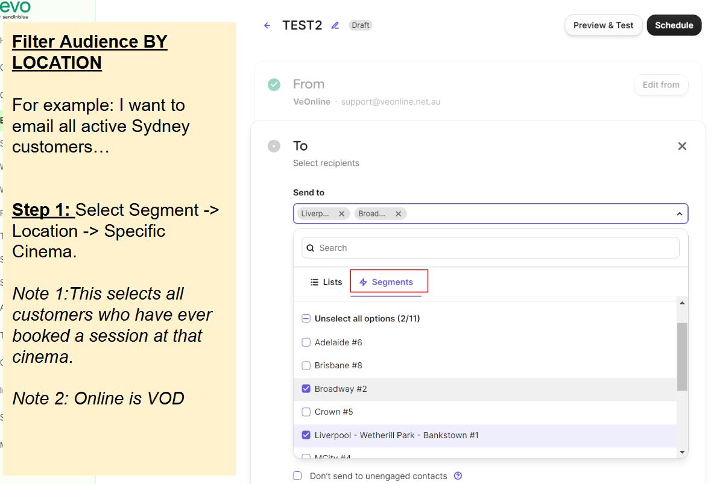

# Digital Displays

* Please email 1 ZIP file to [daniel@infinityenm.com](mailto:daniel@infinityenm.com) with the following files.
* Please double check size + format (all JPEG) + max size.
* Tip: You can use Save for web lower profile (Photoshop) to downsize, or [https://tinyjpg.com/](https://tinyjpg.com/)
* Tip: To remove / extend background, it's best to use generative fill feature [https://www.adobe.com/au/products/photoshop/generative-fill.html](https://www.adobe.com/au/products/photoshop/generative-fill.html)

Official Poster

* W x H : 1152 x 2048 px
* File: JPEG
* Max size: 1 MB
* Text: With or without is OK
* Logo: With logo

**Placement**

Hold Screen

* W x H : 1920 x 1080 px
* File: JPEG / DCP .ZIP (See below)
* Text: **YES** text (In cinemas Date)
* Logo: **WITH** film title logo + VeOnline & Film Viet AUS logo (see examples) + any logos that were already on the original poster file

**Placement**

.png>)

**Examples**

.png>)

.png>)

.png>)

