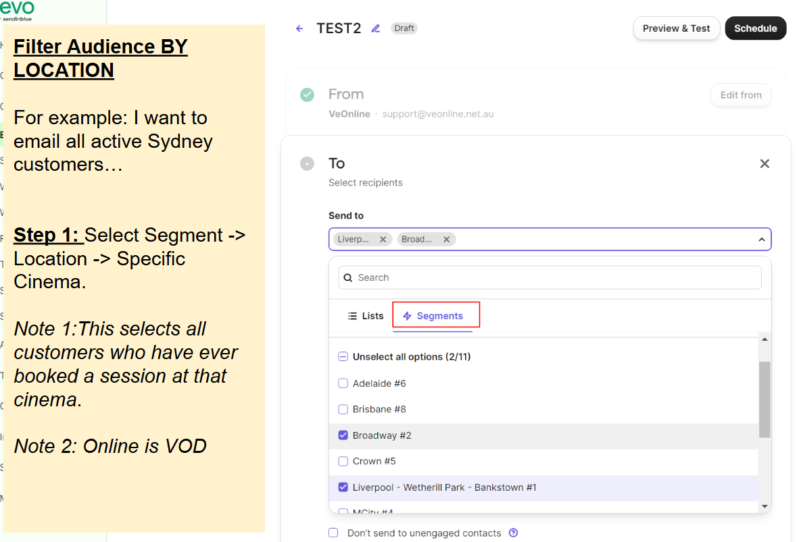

# Hold Screen DCP

* Please double check size + format (all JPEG) + max size.
* Tip: You can use Save for web lower profile (Photoshop) to downsize, or [https://tinyjpg.com/](https://tinyjpg.com/)
* Tip: To remove / extend background, it's best to use generative fill feature [https://www.adobe.com/au/products/photoshop/generative-fill.html](https://www.adobe.com/au/products/photoshop/generative-fill.html)

Hold Screen

* W x H : 1920 x 1080 px
* File: [DCP .ZIP (See below)](hold-screen-dcp.md#quick-guide-creating-a-.zip-dcp-file-from-an-image-with-dcp-o-matic)
* Text: **YES** text (In cinemas Date)
* Logo: **WITH** film title logo + VeOnline & Film Viet AUS logo (see examples) + any logos that were already on the original poster file
* Please upload the ZIP file to [https://drive.google.com/drive/folders/1051UsGsLVVIk\_0r5qeVvuwodddvD-svT?usp=sharing](https://drive.google.com/drive/folders/1051UsGsLVVIk_0r5qeVvuwodddvD-svT?usp=sharing)

**Placement**

.png>)

**Examples**

.png>)

.png>)

.png>)

## Quick Guide: Creating a .ZIP DCP File from an Image with DCP-o-matic

What is it: A **Digital Cinema Package (DCP)** is a collection of files, formatted according to DCI standards, used for delivering feature films, trailers, and still images for digital cinema playback.

### Before You Begin

1. **Create and Save Your Image as JPEG**
   * Prepare your final image using photo editing software.
   * Export/save the image as a `.jpg` file.
2. **Download and Install DCP-o-matic**
   * Visit the [DCP-o-matic website](https://dcpomatic.com/) and download the latest version.
   * Follow the on-screen instructions to install it.

### Steps to Create a DCP

1. **Open DCP-o-matic**\
   Launch DCP-o-matic on your computer.
2.  **Create a New Project**

    * Click **File > New**, choose a location, and name your project `HOLDSCREEN_<MOVIENAME>`

    <figure><figcaption></figcaption></figure>
3.  **Add Your Image**

    * Click **Add files…**
    * Select your previously saved JPEG file.

    <figure><figcaption></figcaption></figure>
4.  **Set DCP Parameters**

    * Tab **DCP > Content Type** **> Promo**

    <figure><figcaption></figcaption></figure>
5. **Make the DCP**
   * &#x20;<mark style="background-color:green;">**Ctrl / Cmd + M**</mark>&#x20;
   * Confirm the DCP output folder
   * Ignore any warnings
   * Click **OK** to start the DCP creation.
6. **Locate the DCP Folder**

.png>)

* Once complete, find the DCP folder containing files like `CPL`, `PKL`, `VOLINDEX`, and `.mxf`
* Right-click the DCP folder.
* Select **Compress** or **Zip** to create a `.zip` archive.&#x20;
* Please upload this ZIP to [https://drive.google.com/drive/folders/1051UsGsLVVIk\_0r5qeVvuwodddvD-svT?usp=sharing](https://drive.google.com/drive/folders/1051UsGsLVVIk_0r5qeVvuwodddvD-svT?usp=sharing)

&#x20;<mark style="background-color:purple;">**Note: The file size of a DCP ZIP should be 80 MB - 200 MB. Don't panic !**</mark>&#x20;
